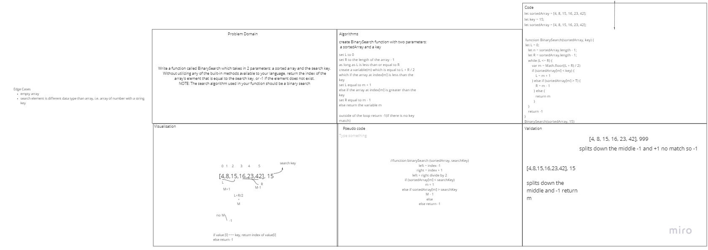

# code challenges

## Reverse an Array code challenge 01

### Challenge

The challenge is to search an array binarily returning the index of a valid search and -1 for an invalid search

### Approach and Efficiency

<!-- what approach did you take and why? What is the big O? -->

### solution

### Authors

Sara Strasner
Garrett Cintron

