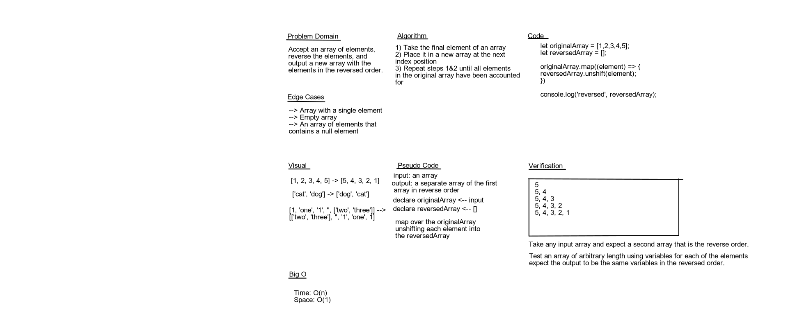

# Reverse an Array

## Challenge

The challenge is to accept an array as input and reverse it outputting a new array

## Approach and Efficiency

<!-- what approach did you take and why? What is the big O? -->

## solution

## Authors

Simon Panek
Garrett Cintron
