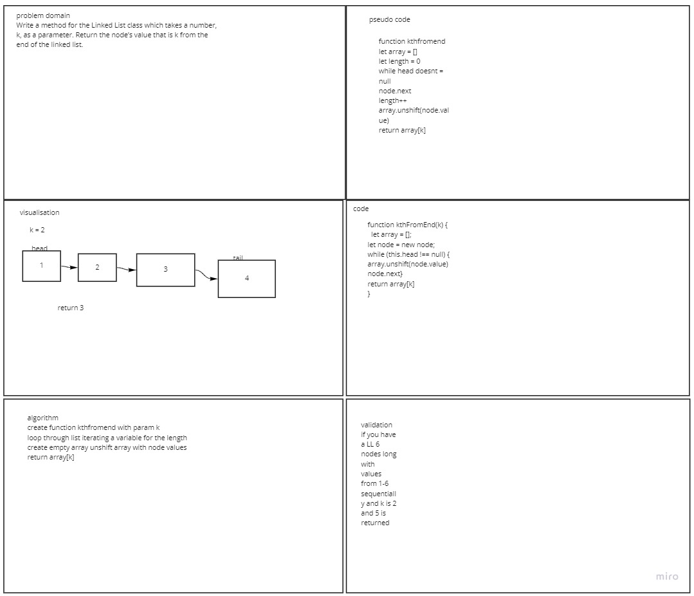

# code challenges

## code challenge 05

### challenge

Define a method called insert which takes any value as an argument and adds a new node with that value to the head of the list with an O(1) Time performance.
Define a method called includes which takes any value as an argument and returns a boolean result depending on whether that value exists as a Node’s value somewhere within the list.
Define a method called toString (or __str__ in Python) which takes in no arguments and returns a string representing all the values in the Linked List, formatted as:
"{ a } -> { b } -> { c } -> NULL"

### approach and efficiency

I wrote the code and then the whiteboard for the code

### solution  

##  code challenge 06

### Challenge

write an append insert before and insert after method for the linked list class

### Approach and Efficiency

<!-- what approach did you take and why? What is the big O? -->
i approached the challenge using TDD the big o is o(n)1 for all three for space and o(n)1 for time
### solution

### Authors

Garrett Cintron

## code challenge 07

### challenge

Write a method for the Linked List class which takes a number, k, as a parameter. Return the node’s value that is k from the end of the linked list. 

### approach and efficiency

### solution

### authors

Garrett Cintron